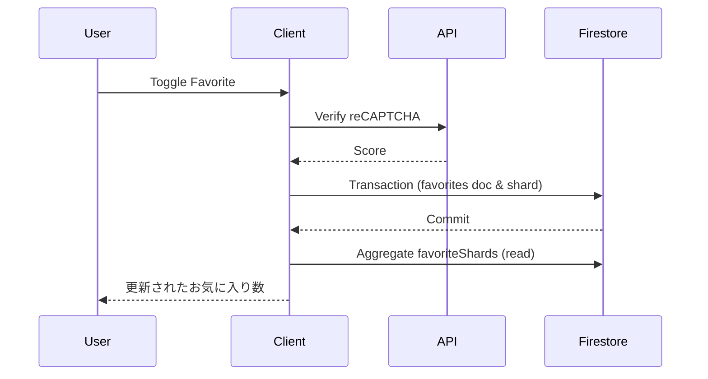

# アーキテクチャ概要

## シーケンス図: お気に入りトグル



## Firestore スキーマ

```mermaid
erDiagram
  POSTS ||--o{ FAVORITES : has
  POSTS ||--o{ FAVORITESHARDS : has
  FAVORITES {
    string uid
    timestamp createdAt
  }
  FAVORITESHARDS {
    number count
  }
  POSTS {
    number favoriteCount
    ...
  }
```

`favoriteCount` フィールドは Cloud Function またはクライアント集計でキャッシュされます。
